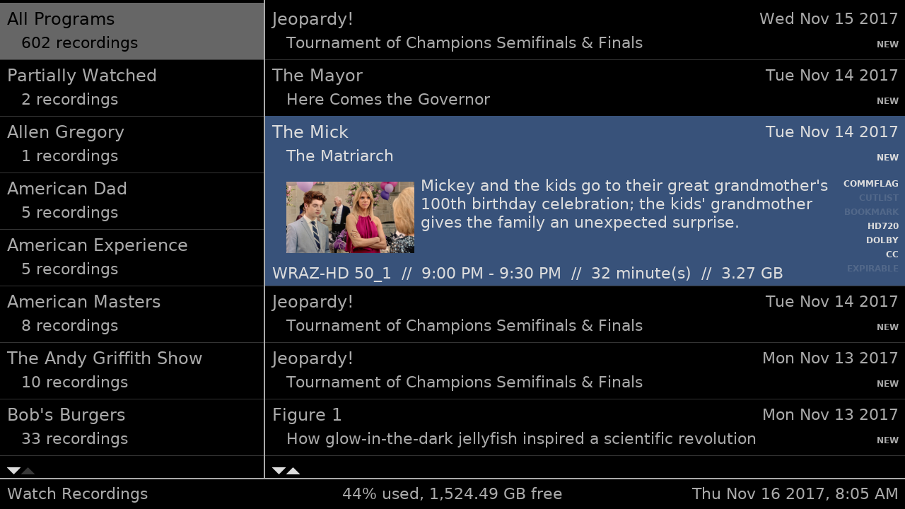

# Corner Case theme for MythTV

Corner Case is designed to be a plain theme with a boxy appearance. It contains no animations and very little artwork. Its goal is to avoid displaying any distracting elements, while at the same time looking clean and attractive. Corner Case was inspired by the ArcLight and Mythbuntu themes.

Not all windows have been themed in the Corner Case style. Notably, none of the MythTV plugins have been themed. Unthemed windows will fall back either to the MythTV defaults or to the Mythbuntu version on which this theme was originally based.

## Building

Source files for the theme are provided in the `src` directory. To build the theme:

1. Install perl.
1. Install the following perl packages:

    - Template
    - File::Copy::Recursive

1. Run `perl build.pl` from the repo's root directory.

The resulting theme will be stored in the `corner_case` directory.

## Installing

Copy the `corner_case` directory into the `~/.mythtv/themes` directory of the user running `mythfrontend`. Enter the Theme Chooser screen on the frontend and select Corner Case from the list.
